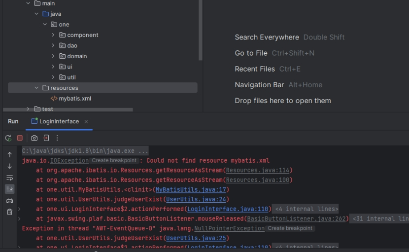
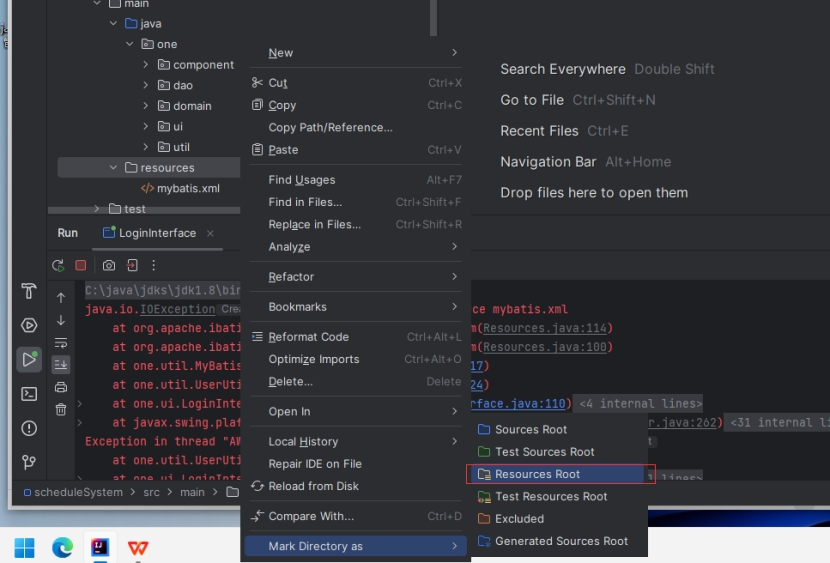
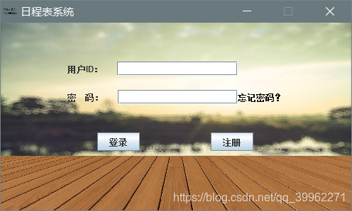
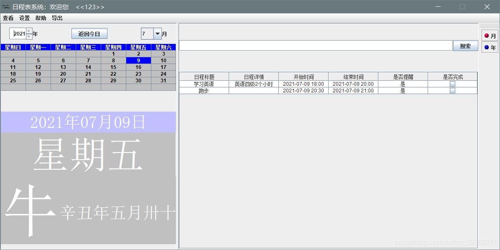
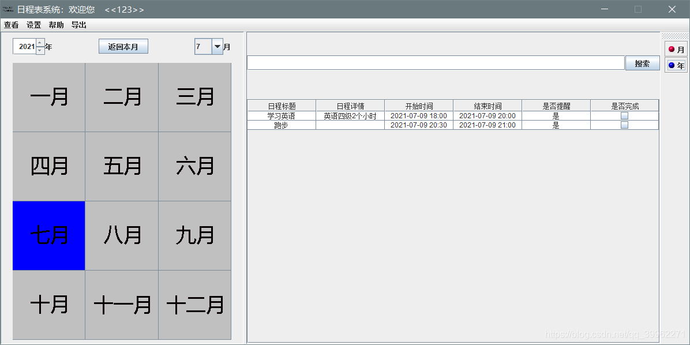
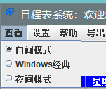
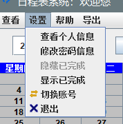
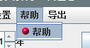
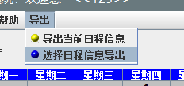
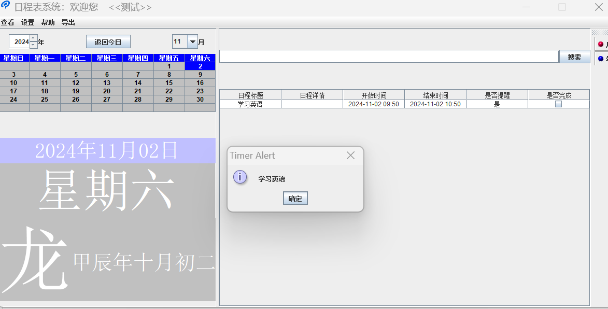

### 软件配置操作说明：

Jdk版本1.8；

mysql版本：5.5.36,mysql安装配置详情见csdn：[MySQL5.5安装和navicat安装配置图解-CSDN博客](https://blog.csdn.net/qq_39962271/article/details/122513215)

登录用户信息表，请参照mysql,schedule下的user

项目直接导入idea后，idea会自动加载maven项目，请等待加载完毕；

加载完毕后，找到\src\main\java\one\ui\LoginInterface.java 文件，点击运行即可；

### 可能遇到的问题：

 运行后，登录时，控制台报错：如下↓

 

解决办法：

将目录设置为resources root 目录格式；重新运行就可以了；

 

### 基于Java日程表系统的设计与实现--部分界面与功能展示
编写语言是Java Swing,使用Mybatis框架操作数据库。部分界面效果图如下：

#### 登录界面：

用户在没有账号之前，通过输入用户信息（用户ID，用户呢称，性别，用户生日，用户密码，密保问题），并输入验证码，完成用户注册。
用户通过输入用户ID和密码，完成用户登录操作。
当用户忘记密码时，可以点击登录页面的忘记密码按钮，输入用户ID进入忘记密码页面，用户通过输入正确的密保信息，并输入新密码,完成用户密码找回。

#### 程序主界面：

日程表系统主界面是用户使用的主要界面，界面主要分为月视图页面和年视图界面，月视图界面主要已日为单位，显示每日的日程信息，可以对日程信息进行添加修改查询操作，同时含有万年历页面，可以显示农历，节气，节日信息。年视图界面主要以月为单位，显示每月的日程信息，同时可以对日程信息进行添加修改查询操作。

##### 	1、月视图界面

	双击对应日期，可实现添加日程操作；

##### 	2、年视图界面

##### 3、主页面菜单栏

（1）主页面有三种显示模式，可点击菜单栏查看进行选择，分别是白间模式，经典模式，夜间模式。

（2）在主页面菜单栏“设置”中有查看个人信息、修改密码信息、隐藏已完成、显示已完成、切换账号、退出等6个菜单项。查看个人信息页面可以显示用户基本信息（用户昵称，性别，出生日期），可点击修改个人信息按钮修改用户的基本信息。修改密码及密保相关信息可以点击修改密码信息页面，用户通过输入正确的旧密码信息完成对密码等相关信息的修改。通过选择隐藏已完成或显示已完成，实现日程信息是否需要显示已完成的日程信息。选择切换账号，返回登录界面。选择退出，退出日程表管理系统。

（3）帮助：显示开发者信息界面

（4）在主页菜单栏导出中，有导出当前日程信息和选择日程信息导出两个选项。导出当前日程信息是导出当前页面所显示的日程信息，选择日程信息导出是通过选择时间段，来导出其相应的日程信息。

#### 4、提醒界面展示

#### 如果对你有帮助，请我喝杯可乐吧！！！

